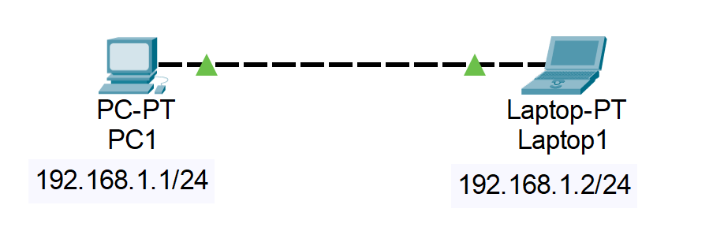
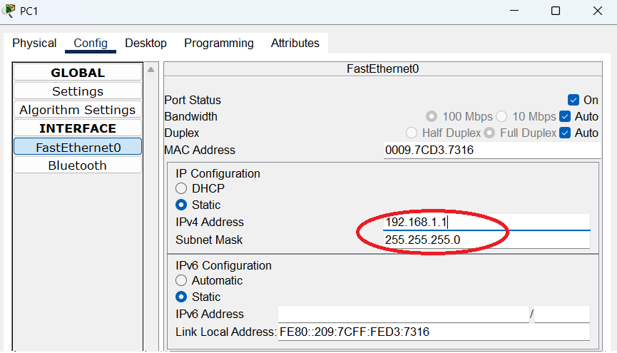
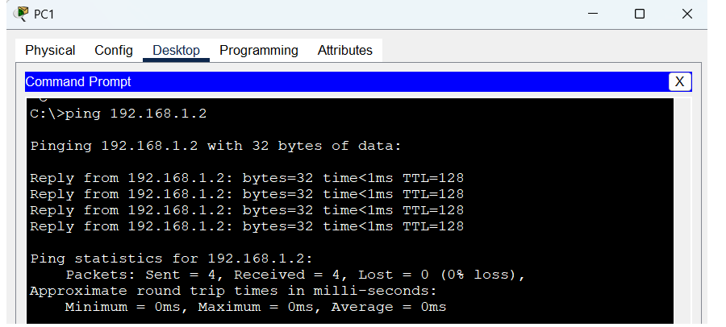
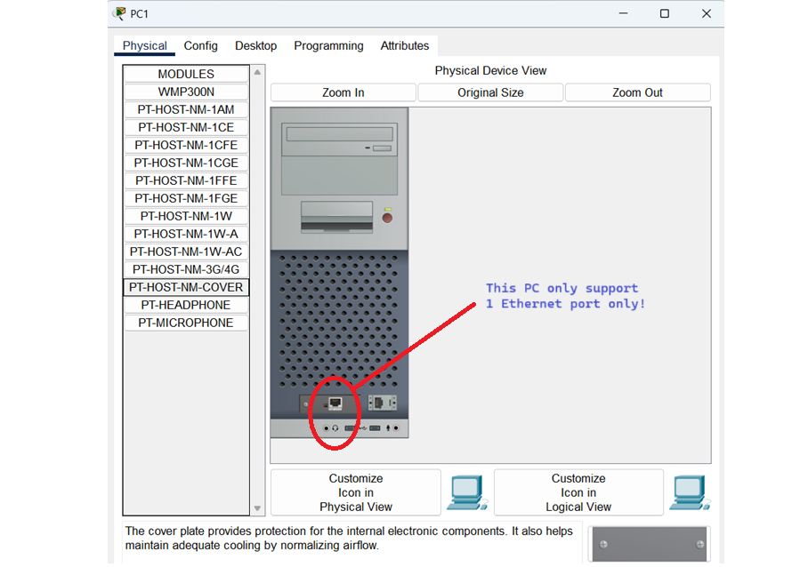
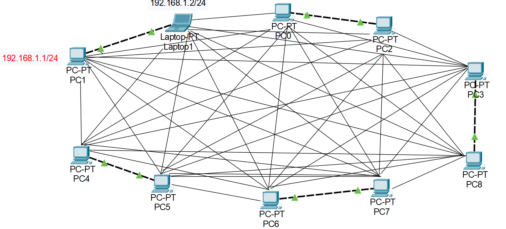

# The-Art-of-Networking

Networking is the process of establishing communication links between devices. These physical or logical connections form what is known as a network topology. In this point, we will try to design a topology.

## 📚 Contents
- [Your First Simple Topology](#your-first-simple-topology)
- [Introducing-a-Switch](#introducing-a-switch)
- [Disclaimer](#disclaimer)

---

## Your First Simple Topology

Let's first build a simple network containing two devices: PC1 and Laptop1. We need to make a communication link between the two by just building the network illustration below (I use Packet Tracer to build this figure):

To build this in Packet Tracer, place 1 PC and 1 Laptop. Connect them with copper cross-over cable (denoted by a dashed line). Configure your PC and laptop IP address with value of 192.168.1.1/24 and 192.168.1.2/24 respectively by opening the __Config__ tab when you click the PC icon like the image below.

Now, we use the __ping__ command to check if PC1 can connect to Laptop1 and vice-versa. In PC1, ping the 192.168.1.2 of Laptop1 and do the reverse. You should notice the following output ensuring your network topology works.

Nice! You have created a working network. What if we would like to introduce another PC in the topology. Just simply connect another cable, right? But if you'll look at the __Physical__ tab of the PC1, there is only one FastEthernet port to be used like the image below. This can be fixed by adding Ethernet ports or external adapters to extend the number of current ports we are using (however, Packet Tracer does not allow us to do this).

Let's say, we managed to extend the number of Ethernet ports of each PC. And imagine we assumed we are able to connect 3 PCs. 5 PCs. 10 PCs. The cable management could be very messy! Plus Ethernet ports of PCs are limited.

That's why someone invented a switch!

---

## Introducing a Switch

---

## Disclaimer

There are many things to learn in networking. You can learn one step at a time. Networking is so complex and complicated!
