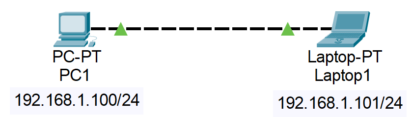

# The-Art-of-Networking

Networking just means building a network between devices. This means building a communication link between devices within a network. Building this physical link is often referred to as network topology.

## 📚 Contents
- [Your First Simple Topology](#your-first-simple-topology)
- [Disclaimer](#disclaimer)

---

## Your First Simple Topology

Let's first build a simple network containing two devices: PC1 and PC2. We need to make a communication link between the two by just building the network illustration below (I use Packet Tracer to build this figure):

To build this in Packet Tracer, place 1 PC and 1 Laptop. Connect them with copper cross-over cable (denoted by a dashed line). Configure your PC and laptop IP address with value of 192.168.1.1/24 and 192.168.1.2/24 respectively by opening the __Config__ tab when you click the PC icon like the image below.

---

## Disclaimer

There are many things to learn in networking. You can learn one step at a time. Networking is so complex and complicated!
